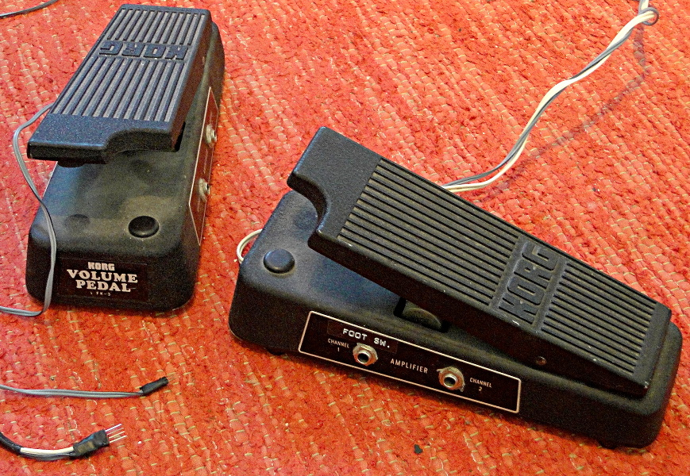
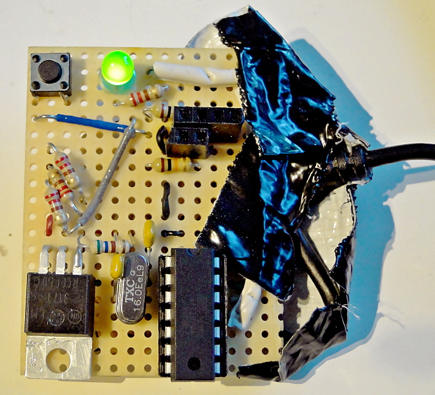

# PraashPedal

PraashPedal is a small electronics project built on two unused KORG guitar volume pedals,
turning them into a class-compliant(-enough-for-Linux) USB MIDI controller,
used for controlling synthesizers and guitar effects.
This project utilizes the [V-USB](https://www.obdev.at/products/vusb/index.html) library.

This repository contains the firmware source.

### Main components
* Atmel ATTiny84 with 16MHz crystal
* LM317 voltage regulator at ~3.4V
* 2x KORG FK-3 volume pedals with 25kOhm potentiometers

### Features
* Acts as a driverless USB device
* Provides 2 continuous and 2 two-state MIDI CC controllers
* Manual calibration for pedal extremes
* Calibration data is permanently stored in EEPROM
* Connection for a guitar amplifier footswitch for additional looper/effect control

## Issues
* The device descriptor is dodgy and Linux's kernel log complains about it. Doesn't work at all on Macs.

## Building
Download the latest V-USB release, and copy the contents of its `usbdrv` into the `usbdrv` directory of this project.
If you don't happen to use an ATTiny84, you need to tweak lots of things.
Then, simply run 
      make
      make flash

[Demonstration video](https://youtu.be/3chLeBRuCPc)
